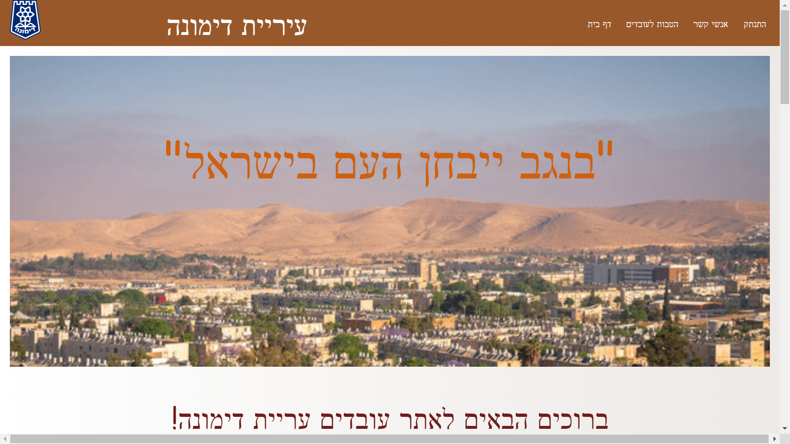

# Hackathon project
## Site for Dimona city employee workers
### This site was built for Dimona municipality employees to allow them better communication between themselves and the municipality

***

## Running the project

1. Clone the repo.
2. Run `npm install`.
3. enter the server folder.
4. run `nodemon server.js`.
5. go back to the root folder.
6. Run `npm start`.
7. Navigate to `http://localhost:3000`.

***

## Technologies:

### clinet-side:
* reactJS
* MUI
* React-Hook-Forms
* yupp

### server-side:
* node.js
* express
* mongoDB
* JWT
* Bcrypt

***

